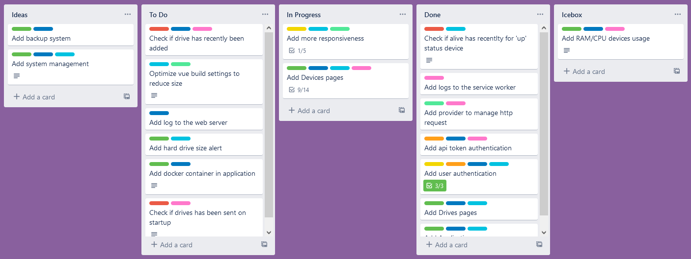

[![MIT License][license-shield]][license-url]
[![LinkedIn][linkedin-shield]][linkedin-url]

<h1 align="center">
	<b>SERVER MONITORING</b>
	<br />
	<small align="center">Back End</small>
</h1>

<details open="open">
  <summary>Table of Contents</summary>
<!-- TOC depthfrom:2 -->

-   [About The Project](#about-the-project)
    -   [Routes](#routes)
    -   [Build with](#build-with)
-   [Getting Started](#getting-started)
    -   [Prerequisites](#prerequisites)
    -   [Installation](#installation)
-   [Roadmap](#roadmap)
-   [License](#license)
-   [Contact](#contact)

<!-- /TOC -->
</details>

## About The Project

Web application allowing to have information on a server, with the possibility to add links to local web servers and services (Back End).

-   [Front End](https://github.com/KristenJestin/server-monitoring-front)
-   [Service Worker](https://github.com/KristenJestin/server-monitoring-service-worker)

### Routes

-   **Auth**
    -   Login
    -   Logout
-   **Drives**
    -   Get All
    -   Create
    -   Show
    -   Update
    -   Delete
-   **Applications**
    -   Get All
    -   Create
    -   Show
    -   Update
    -   Delete
    -   Image : _get the image file_
    -   Status : _get the service status_
-   **Devices**
    -   Get All
    -   Create
    -   Show
    -   Update
    -   Delete
    -   Uptime: _get all uptime data_
    -   Deactivate: _Possibility to activate or deactivate a device_
    -   Drives: _get all drives data_
    -   RegenerateApiKey
-   **Device Models**
    -   Get All
    -   Create
    -   Show
    -   Update
    -   Delete

### Build with

-   [AdonisJs](https://adonisjs.com/)
-   [TypeScript](https://www.typescriptlang.org/)
-   [InertiaJs](https://inertiajs.com/)

## Getting Started

### Prerequisites

-   [NodeJs](https://nodejs.org/)

### Installation

1. Clone the repo
    ```sh
    git clone https://github.com/KristenJestin/server-monitoring-back.git
    ```
2. Create .env file with appropriate data (.env.exemple for exemple)
3. Migrate database
    ```sh
    node ace migration:run
    ```
    3.1. Seed database
    ```sh
    node ace db:seed
    ```
4. Install the front end part [Server Monitoring - Front end](https://github.com/KristenJestin/server-monitoring-front) in _ui_ folder
5. Start app
    ```sh
    yarn run dev
    ```
6. (Optional) Install the service worker part [Server Monitoring - Service Worker](https://github.com/KristenJestin/server-monitoring-service-worker) in _ui_ folder

## Roadmap

All future features are available on [Trello](https://trello.com/b/5A8iO3Xc/%F0%9F%93%8A-server-monitoring).



## License

Distributed under the MIT License. See `LICENSE` for more information.

<!-- CONTACT -->

## Contact

Kristen JESTIN - [contact@kristenjestin.fr](mailto:contact@kristenjestin.fr)

Project Link: [https://github.com/KristenJestin/server-monitoring-back](https://github.com/KristenJestin/server-monitoring-back)

<!-- MARKDOWN LINKS & IMAGES -->

[license-shield]: https://img.shields.io/github/license/KristenJestin/server-monitoring-back.svg?style=for-the-badge
[license-url]: https://github.com/KristenJestin/server-monitoring-back/blob/master/LICENSE
[linkedin-shield]: https://img.shields.io/badge/-LinkedIn-black.svg?style=for-the-badge&logo=linkedin&colorB=555
[linkedin-url]: https://linkedin.com/in/kristen-jestin
